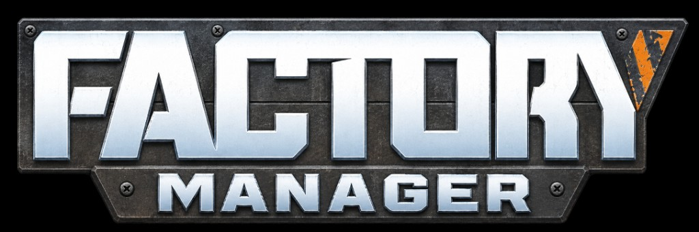

# Factory Manager

<p align="center">
  
</p>

> English: [`README.md`](README.md)

App desktop locale per pianificare le fabbriche di Satisfactory.

L’ho fatta perché calcolare a mano catene, macchine, rate, estrazioni ed energia diventa presto un pasticcio. Factory Manager tiene catalogo oggetti, schemi di produzione e schemi energia sul PC — niente account, niente cloud, non affiliato a Coffee Stain.

Pianifica catene, macchine, rate e layout in locale. Fan-made. Indipendente. Non affiliato a Coffee Stain.

## Funzionalità

### Auto-plan dagli obiettivi

Scegli uno o più prodotti e un rate al minuto: l’app costruisce la catena (ricette default, estrazioni, collegamenti), unendo gli intermedi condivisi invece di duplicarli. Modifica gli obiettivi quando vuoi: l’albero si ricostruisce.

Stessa logica per l’**energia**: target MW, tipo di generatore e combustibile. I generatori si dimensionano da soli, con estrazioni carbone/acqua oppure un piano di produzione combustibile collegato.

### Vincoli da fabbrica vera

- **Budget power shard** — limitato (default 0 → preferisci clock al 100%) oppure illimitato
- **Nastro / tubo Mk massimi** — usati sugli archi e nella modalità Complesso
- **Sink sottoprodotti** — linee opzionali per smaltire gli output secondari non usati (packaging fluidi, sink solidi)

### Vista ad albero navigabile

- Grafo sinistra → destra: estrazioni → passi → obiettivi (e in energia: estrazioni → generatori → MW)
- **Semplice / Complesso** — Complesso divide gli step in banchi manifold quando nastro/tubo non reggono tutto il flusso
- **Pan, zoom, adatta, schermo intero** — scroll per zoom nitido, trascina lo sfondo per spostarti, Fit per inquadrare, fullscreen per i piani grandi
- Header compatto in modalità albero così il canvas prende lo schermo
- Conteggio macchine @ clock in evidenza su nodi e passi; riepilogo costruzione per edificio

### Produzione ed energia

- Catalogo oggetti e ricette del gioco
- Catene di produzione: input, output, numero macchine, rate, overclock, Somersloop
- Estrazioni e potenza (generatori + combustibile)
- Salva i progetti e riaprili dopo

### Condividi e riprendi gli schemi

Esporta e importa in JSON sia la produzione sia l’energia (estrazioni, generatori, collegamenti). Un file = un backup o uno scambio con un amico. Gli import arrivano etichettati `(import)` così non confondi gli originali. Prima di scrivere nel database, l’import verifica che il file sia davvero un export Factory Manager.

### Energia e Power Shards

- Consumo base (MW) nel catalogo per estrattori e macchine di produzione
- Consumo calcolato su schemi ed estrazioni con overclock e Somersloop
- Frammenti energetici necessari nel riepilogo laterale e totale nel box Info
- Dashboard con KPI consumo/bilancio, grafico produzione vs consumo, top catene e avviso se sprechi più di quanto produci
- Stato chiaro: Coperta / Deficit / Non coperta, con MW di margine o di deficit

### Multilingua

Parti da italiano e inglese, poi tutte le lingue del catalogo SCIM (tedesco, francese, spagnolo, polacco, portoghese, olandese e altre): interfaccia + nomi di risorse, edifici e ricette. La preferenza resta al riavvio. Per arabo, ebraico e persiano c’è un layout RTL di base. Se manca un pezzo di UI, si cade in inglese senza rompere l’app. Le nuove installazioni partono da UI inglese e formato numeri en-US.

### Desktop, dati sul tuo PC

Windows: installer NSIS oppure portable. Ci sono anche build macOS e Linux quando pubblicate. I dati restano in locale (AppData su Windows), con migrazione automatica se venivi da un percorso precedente. Tutto offline.

In footer trovi disclaimer e attribuzione Coffee Stain. Logo aggiornato, interfaccia più pulita (niente menu nativo Windows), popup Info più leggibile.

### Comfort quotidiano

- Avvio più affidabile sui PC lenti (niente processo “fantasma”)
- Splash «Preparazione dati…» al primo seed del catalogo
- Menu sticky mentre scorri
- Dashboard KPI a 4 colonne; elimina progetto al passaggio del mouse
- In Impostazioni: tetti macchine/generatori e formato numeri (IT / US)
- Calcolatrice flottante; hardening Electron, sandbox, limiti sui file

### Aggiornamenti

All’avvio può controllare GitHub: se c’è una versione nuova compare un banner chiudibile con link al download. Nessun download forzato.

I dati possono essere sbagliati o non aggiornati dopo una patch del gioco. Se ti serve precisione, ricontrolla i numeri in-game.

## Release vs build da soli

Le GitHub Releases includono installer / portable Windows (e altre piattaforme quando pubblicate). Quei binari escono da questo repo con electron-builder. **Non sono firmati**: SmartScreen su Windows (e avvisi simili su macOS/Linux) può lamentarsi — normale per un’app indie senza certificato, non è prova che il file sia dannoso.

Se preferisci non fidarti di un `.exe` già pronto, compila dal sorgente (passi sotto). È l’opzione più trasparente.

## Changelog

- Italiano: [`CHANGELOG.md`](CHANGELOG.md)
- English: [`CHANGELOG.en.md`](CHANGELOG.en.md)

## Build dal sorgente (passo passo)

Non serve essere sviluppatori. In sintesi: installi Node.js, scarichi il codice, installi le dipendenze, avvii o buildi.

### 1. Installa Node.js

1. Apri [https://nodejs.org](https://nodejs.org)
2. Scarica la versione **LTS** per il tuo sistema
3. Installa con le opzioni predefinite
4. Apri un terminale (PowerShell su Windows, Terminale su macOS/Linux) e verifica:

```bash
node -v
npm -v
```

Entrambi devono stampare un numero di versione. Se falliscono, chiudi e riapri il terminale (o riavvia) e riprova.

### 2. Prendi il codice

**Opzione A — Git (se lo hai):**

```bash
git clone https://github.com/raffaelemaiorino/factory-manager.git
cd factory-manager
```

**Opzione B — ZIP da GitHub:**

1. Nella pagina del repo: **Code → Download ZIP**
2. Scompatta in una cartella facile da trovare
3. Nel terminale, `cd` in quella cartella

### 3. Installa le dipendenze

Dalla cartella del progetto:

```bash
npm install
```

Scarica Electron e il resto. Può volerci qualche minuto.

### 4. Avvia l’app (senza installer)

```bash
npm start
```

Oppure con più log in console:

```bash
npm run dev
```

Stesso approccio su Windows, macOS e Linux — è una normale app Electron.

### 5. Build installer / portable

```bash
npm install
npm run build:win     # Windows: installer NSIS + portable exe
npm run build:mac     # macOS: .dmg
npm run build:linux   # Linux: AppImage
```

I file finiti finiscono in `dist/`.  
`npm run build` (senza suffisso) è uguale a `npm run build:win` (tenuto per abitudine).

#### Firma codice Windows (opzionale)

Senza certificato la build Windows non è firmata (SmartScreen può avvisare). Per firmare con Authenticode, imposta prima di `npm run build:win`:

- `CSC_LINK` — percorso al `.pfx` / `.p12` (o `WIN_CSC_LINK`)
- `CSC_KEY_PASSWORD` — password del certificato

electron-builder li legge da solo.

#### Gatekeeper macOS

La build macOS ha `hardenedRuntime` ma **non** è notarizzata da Apple. Gatekeeper avvisa al primo avvio («sviluppatore non identificato») finché non la notarizzi tu (account Apple Developer) oppure l’utente fa click destro → **Apri** una volta.

#### AppImage Linux

Ottieni un unico file `AppImage`. Rendilo eseguibile (`chmod +x`) e avvialo, oppure usa un launcher AppImage. Per eseguirlo direttamente spesso serve `libfuse2`; senza, estrai e avvia:

```bash
./Factory*.AppImage --appimage-extract
./squashfs-root/factory-manager
```

## Architettura (per chi contribuisce)

Tutto gira in locale — niente server né cloud. I dati stanno in un file SQLite (via [sql.js](https://sql.js.org/), SQLite in WASM) nella cartella app-data di Electron.

- **`electron/`** — processo main: finestra/ciclo di vita (`main.js`), bridge IPC come `window.satisfactory` (`preload.js`), check aggiornamenti GitHub (`update-check.js`), stato UI della vista produzione in JSON (`production-ui-state-store.js`).
- **`src/database/`** — layer dati nel main, solo via IPC: schema/migrazioni, file di dominio (`items.js`, `buildings.js`, `production-chains.js`, `auto-plan.js`, `auto-plan-energy.js`, …), seed in `seeds/`.
- **`src/renderer/`** — UI (`index.html` + `<script>` semplici, senza bundler). L’ordine di caricamento in `index.html` conta: gli script condividono uno scope globale.
- **`src/locales/ui/`** — pack lingue UI (non il catalogo di gioco).
- **`scripts/`** — helper di import manuali (`npm run import:*`). I generatori one-off stanno in `scripts/archive/` — vedi `scripts/archive/README.md`.

Non c’è ancora una suite di test automatici; si verifica avviando l’app e provando il flusso toccato.

## Community

Gruppo Facebook: [Factory Manager](https://www.facebook.com/groups/factorymanager)

## Crediti

- **Auto-plan** (produzione ed energia da obiettivi) e vista ad albero navigabile: [@loafdaddy](https://github.com/loafdaddy) — [PR #3](https://github.com/raffaelemaiorino/factory-manager/pull/3), integrato in **2.0.0**.

## Disclaimer

Factory Manager è un progetto fan indipendente e non ufficiale. Non è affiliato, approvato, sponsorizzato né collegato a Coffee Stain Studios AB, Coffee Stain Publishing AB o altre società Coffee Stain.

Satisfactory e i relativi nomi, marchi, loghi, immagini, icone, dati e asset appartengono a Coffee Stain Studios AB e/o ai rispettivi titolari. Questa app non rivendica diritti su quei contenuti; i riferimenti al gioco servono solo a identificarlo e a pianificare.

Factory Manager non sostituisce Satisfactory, non permette di giocare e non distribuisce eseguibili o file del gioco. È fornito così com’è, senza garanzie.
